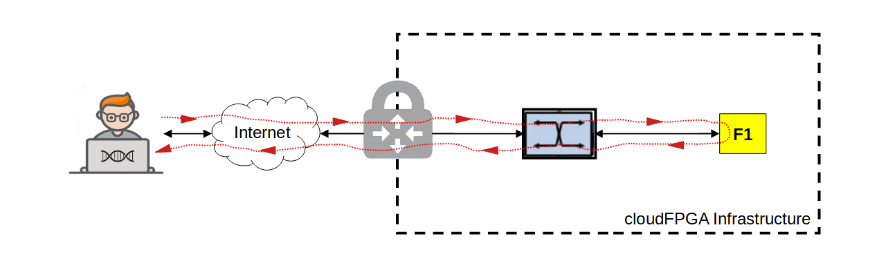

# cFp_HelloKale

A cloudFPGA project built upon the shell *Kale*. 

## Overview

This project builds on the shell [Kale](https://github.com/cloudFPGA/cFDK/blob/main/DOC/Kale.md) 
which is a shell with minimalist support for accessing the hardware components of the FPGA 
instance, and a role that implements a set of TCP and UDP loopback mechanisms for echoing the 
incoming traffic and forwarding it back to its emitter. 

This setup corresponds to an FPGA server implementing only two UDP and TCP echo services. 
The FPGA accepts connections on port `8803` and echoes every incoming lines back to the client 
(using the carriage-return/line-feed sequence as line separator). The resulting traffic scenario 
is shown in the following figure.

       

## Shell-Role-Architecture
In **cloudFPGA** (cF), a user application is referred to as a **ROLE** and is integrated 
along with a **SHELL** that abstracts the hardware components of the FPGA module. 
The combination of a specific ROLE and its associated SHELL into a toplevel design (**TOP**) is
referred to as a **Shell-Role-Architecture** (SRA). 

The shell-role-architecture used by the project *cFp_HelloKale* is shown in the following figure. 
It consists of: 
  - a SHELL of type [_**Kale**_](https://github.com/cloudFPGA/cFDK/blob/main/DOC/Kale.md) 
  which is a shell with minimalist support for accessing the hardware components of the 
  FPGA module FMKU060. The shell *Kale *includes the following building blocks: 
    * a [10 Gigabit Ethernet (ETH)](https://github.com/cloudFPGA/cFDK/blob/main/DOC/ETH/ETH.md) sub-system,
    * a [Network Transport Stack (NTS)](https://github.com/cloudFPGA/cFDK/blob/main/DOC/NTS/NTS.md),
    * a [DDR4 Memory sub-system (MEM)](https://github.com/cloudFPGA/cFDK/blob/main/DOC/MEM/MEM.md), 
    * a [Memory Mapped IO (MMIO)](https://github.com/cloudFPGA/cFDK/blob/main/DOC/MMIO/MMIO.md) sub-system.
  - a ROLE of type [_**HelloKale**_](./DOC/BringUpRole.md) which implements a set of TCP-, 
  UDP- and DDR4-oriented tests and functions for the bring-up the cloudFPGA module.


<p align="center">Toplevel block diagram of the cFp_HelloKale project</p>
<br>

**Info/Warning**
  - The shell [_**Kale**_](https://github.com/cloudFPGA/cFDK/blob/main/DOC/Kale.md) does 
  not support **Partial Reconfiguration** (PR). 
  It was specifically developed for the bring-up of a new FPGA module or for the deployment 
  of a static implementation. As a result, the generated bitstream is always a static 
  bitstream. 
  Refer to the project [_cFp_HelloThemisto_](https://github.com/cloudFPGA/cFp_HelloThemisto) 
  for an example of a shell that supports PR.
  - The static nature of the generated bitstream precludes its deployment over the 
  datacenter network and requires the use of a JTAG interface to download and configure 
  the FPGA.

## How to build the project

The current directory contains a *Makefile* which handles all the required steps to generate 
a *bitfile* (a.k.a *bitstream*). During the build, both SHELL and ROLE dependencies are analyzed 
to solely re-compile and re-synthesize the components that must be recreated. 
```
$ SANDBOX=`pwd`
```

### Step-1: Clone the project
```
$ cd ${SANDBOX}
$ git clone --recursive git@github.com:cloudFPGA/cFp_HelloKale.git
$ cd cFp_HelloKale/cFDK
$ git checkout main
$ cd ../..
```
### Step-2: Setup your environment
```
$ cd ${SANDBOX}
$ source env/setenv.sh
```

### Step-3: Generate a static bitstream 
```
$ cd ${SANDBOX}
$ make monolithic
```
You find your newly created bitstream in the folder `${SANDBOX}/cFp_HelloKale/dcps`, under the name 
`4_topFMKU60_impl_default_monolithic.bit`.  

#### Step-3.1: Save a checkpoint (optional)
If the design was successfully implemented, you can opt to save its corresponding 
checkpoint in the '_./dcps_' directory. This will accelerate the next build by exploiting the 
incremental place-and-route features of Vivado.
```
$ cd ${SANDBOX}
$ make save_mono_incr
``` 
To request an incremental build, use the command ```$ make monolithic_incr``` instead of 
```$ make monolithic```.


## How to deploy a cloudFPGA instance

### Step-4: Upload the generated bitstream
In order to program a cloudFPGA instance with your newly generated bitfile, you first need 
to upload it to the cloudFPGA **Resource Manager** (cFRM). The below step-4a and step-4b 
will cover the two offered options for uploading a bitstream.  

#### Step-4a: Upload image with the GUI-API  
The cloudFPGA resource manager provides a web-based graphical user interface to its API. It is 
available as a [Swagger UI](https://swagger.io/tools/swagger-ui/) at 
```http://10.12.0.132:8080/ui/#/```.

To upload your generated bitstream, expand the *Swagger* menu `Images` and the operation 
`[POST] ​/images - Upload an image`. Then, fill in the requested fields as exemplified below.


Next, scroll down to the "*Response body* section of the server and write down the image "*id*" for
use in the next step.  


    
#### Step-4b: Upload image with the cFSP-API 
The second option for uploading a bitstream is based on a command-line interface to the cFRM API.
This method is provided by the **cloudFPGA Support Package** (cFSP) which must be installed 
beforehand as described [here](https://github.com/cloudFPGA/cFSP).   
  
If cFSP is installed, you can upload the generated bitstream located at 
```${SANDBOX}/cFp_HelloKale/4_topFMKU60_impl_monolithic.bit``` with the following command:
```
$ ./cfsp image post --image_file=${SANDBOX}/cFp_HelloKale/4_topFMKU60_impl_monolithic.bit
```
Similarly to the GUI-API procedure, do not forget to write down the image "*id*" returned by 
the server. 


 
### Step-5: Request a cloudFPGA instance and deploy it
Request a cloudFPGA instance to be programmed and deployed with your previously uploaded 
bitfile.
[ TODO - How-to-request-an-instance ]

### Step-6: Ping the deployed FPGA
It is good practise to ping your deployed FPGA to assess its availability.

Use the following command to ping the FPGA with its IP address (see Step-5).
```
$ ping <instance_ip>        (e.g. ping 10.12.200.21)
```

## How to test the features of the cFp_HelloKale
As mentioned above, the role of the project _cFp_HelloKale_ implements a set of TCP-, UDP- 
and DDR4-oriented tests and functions. These features can be called or exercised from a 
remote host as explained in section [_**HOST**_](./HOST/README.md).
